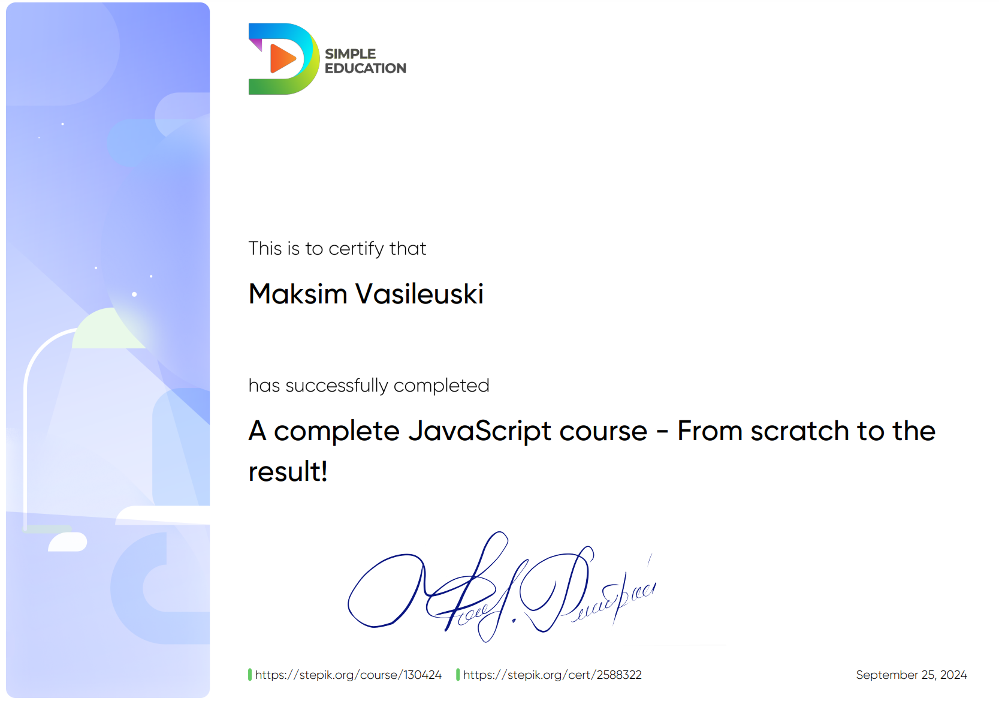
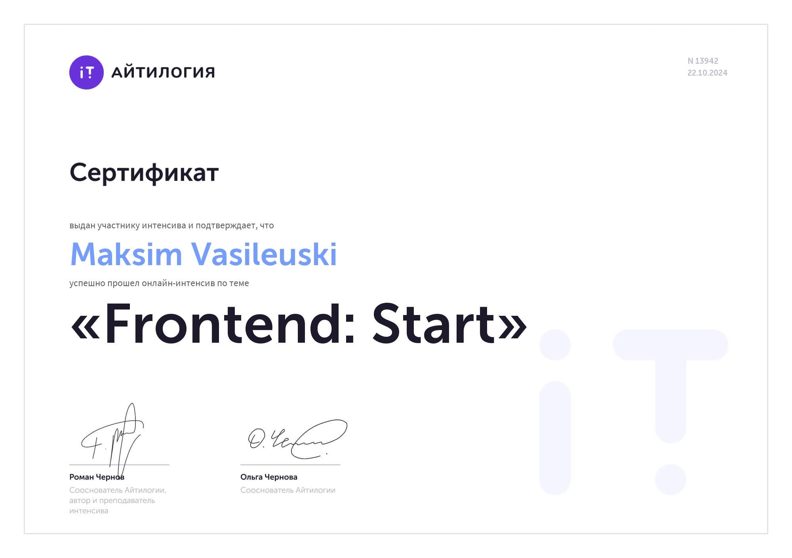

# Maksim Vasileuski
___
### SQL Developer
___
### CONTACT INFO:
* Phone: +375296546913
* Telegram: @vasillkka
* Email: [maksim.vasileuskij@gmail.com](mailto:maksim.vasileuskij@gmail.com)
* [LinkedIn](https://www.linkedin.com/in/maksim-vasileuski-2a267822a/)
* [GitHub](https://github.com/thesoules2000)

___

### PROFILE
SQL Developer with 2+ years experience in working with complex
database systems and supporting various accounting applications.
Skilled in developing and optimizing databases.

___

### SKILLS
* HTML5, CSS3, SASS
* JavaScript Basics, C#, .NET
* PostgreSQL, MySQL
* Git, GitHub, GitLab
* Jira, Scrum
* VS Code, IntelliJ IDEA
* Adobe Photoshop, Illustrator, InDesign, 3dsMax, Figma

### SOFT SKILLS

* Analytical Thinking Skills
* Fast Learner
* Ability to Work Under Pressure
* Creative Problem-Solving

___

### LANGUAGES
* English: B1
* Belarusian: Native
* Russian: Native

___

### EMPLOYMENT HISTORY

SQL Developer, MAPSOFT\
Minsk, Belarus\
Dec 2022 - Present

Starting my career in the company as a Junior SQL Developer, I
completely mastered all the necessary skills from scratch.

In our work, we use a comprehensive database containing numerous
tables with complex relationships. This structure supports various
accounting systems, such as financial and medical.

My work involves developing and optimizing a database for one of the
country's leading universities. The project aims to improve performance
and data protection, as well as create a user-friendly and intuitive
interface for end-users. We have successfully implemented solutions
that have signifcantly accelerated the development process, increased
the volume of work performed, and improved the quality of the
software.

Due to a shortage of staff, I had to learn all aspects of the work on
my own without guidance from a mentor. By gradually studying and
correcting mistakes, I gained deep knowledge and valuable experience.

___

### EDUCATION AND COURSER
IT software , College of Business and Law\
Minsk, Belarus\
2016-2020

#### Web Courses

